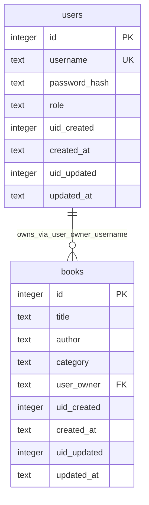

# Data Dictionary — Personal Book Library

เอกสารออกแบบ schema / พจนานุกรมข้อมูล (Phase 2.1)

## บทบาท: Admin vs User

ระบบแยกบทบาทชัดเจนด้วยคอลัมน์ `users.role`

| Role | ค่าใน DB | สิทธิ์ |
|------|----------|--------|
| **Admin** | `admin` | ดู / เพิ่ม / ลบหนังสือ**ทุกคลัง** (ทุก `user_owner`) ได้ |
| **User** | `user` | ดู / เพิ่ม / ลบได้**เฉพาะหนังสือของตัวเอง** (`user_owner = username ของตัวเอง`) |

JWT ควรฝังอย่างน้อย: `{ id, username, role }` เพื่อให้ API ตรวจสิทธิ์ได้

## หลักการ: คลังหนังสือส่วนตัว

โจทย์คือ **Personal Book Library** — user ทั่วไปมีคลังของตัวเอง; admin เป็นผู้ดูแลที่มองเห็นทั้งระบบ

**แยกความหมายชัด:**

| คอลัมน์ | ความหมาย | ใช้ทำอะไร |
|---------|----------|-----------|
| `user_owner` | เจ้าของคลัง / เจ้าของหนังสือ (**username** FK → `users.username`) | กรองสิทธิ์ดู/ลบคลังส่วนตัว |
| `uid_created` | user id ที่กดสร้างแถวนี้ (audit) | บันทึกว่าใครเป็นคนเพิ่ม — **ไม่ใช่**ตัวกำหนดเจ้าของ |

ตัวอย่าง: admin เพิ่มหนังสือให้ alice → `user_owner = 'alice'`, `uid_created = admin.id`

| กฎ | User (`role = user`) | Admin (`role = admin`) |
|----|----------------------|-------------------------|
| เจ้าของหนังสือ | `user_owner` = username ของตัวเองตอนเพิ่ม | ตั้ง `user_owner` เป็น username ของเจ้าของคลังได้ |
| ดูรายการ | `GET` กรอง `user_owner = username ของตัวเอง` | `GET` ได้ทุกแถว |
| เพิ่ม | `POST` ตั้ง `user_owner` = username ตัวเอง + `uid_created` = id ตัวเอง | `POST` ตั้ง `user_owner` ตาม username เจ้าของคลัง + `uid_created` = admin.id |
| ลบ | ลบได้เฉพาะ `user_owner` = username ตัวเอง | ลบหนังสือของใครก็ได้ |
| Auth | ต้องมี JWT | ต้องมี JWT |

## ER Diagram



## Audit fields (ใช้ร่วมทุกตาราง)

| Column | ความหมาย |
|--------|----------|
| `uid_created` | user สร้างแถว (audit เท่านั้น — ไม่ใช่เจ้าของคลัง) |
| `created_at` | สร้างเมื่อ |
| `uid_updated` | user แก้ไขล่าสุด |
| `updated_at` | แก้ไขล่าสุดเมื่อ |

---

## Table: `users`

ตารางผู้ใช้สำหรับระบบ login / JWT — แยกบทบาท `admin` / `user`

| Column | Type | PK | UK | Null | Default | Comment |
|--------|------|----|----|------|---------|---------|
| `id` | INTEGER | Yes | | NO | AUTOINCREMENT | รหัสผู้ใช้ (PK) |
| `username` | TEXT | | Yes | NO | | ชื่อผู้ใช้สำหรับ login |
| `password_hash` | TEXT | | | NO | | รหัสผ่านที่ hash แล้ว (bcrypt) |
| `role` | TEXT | | | NO | `'user'` | บทบาท: `admin` หรือ `user` |
| `uid_created` | INTEGER | | | YES | | user สร้างแถว (audit) |
| `created_at` | TEXT | | | NO | | สร้างเมื่อ (ISO 8601) |
| `uid_updated` | INTEGER | | | YES | | user แก้ไขล่าสุด |
| `updated_at` | TEXT | | | YES | | แก้ไขล่าสุดเมื่อ (ISO 8601) |

### SQL + comments

```sql
CREATE TABLE users (
  id            INTEGER PRIMARY KEY AUTOINCREMENT, -- รหัสผู้ใช้ (PK)
  username      TEXT    NOT NULL UNIQUE,           -- ชื่อผู้ใช้สำหรับ login
  password_hash TEXT    NOT NULL,                  -- รหัสผ่านที่ hash แล้ว (bcrypt)
  role          TEXT    NOT NULL DEFAULT 'user',   -- บทบาท: admin | user
  uid_created   INTEGER,                           -- user สร้างแถว (audit)
  created_at    TEXT    NOT NULL,                  -- สร้างเมื่อ
  uid_updated   INTEGER,                           -- user แก้ไขล่าสุด
  updated_at    TEXT,                              -- แก้ไขล่าสุดเมื่อ
  CHECK (role IN ('admin', 'user'))
);
```

### Seed ตัวอย่าง

| username | password (plain) | role | หมายเหตุ |
|----------|------------------|------|----------|
| `admin` | `password123` | `admin` | ผู้ดูแล — เห็น/จัดการหนังสือทุกคลัง |
| `alice` | `password123` | `user` | ผู้ใช้ทั่วไป — เห็นเฉพาะคลังของตัวเอง |

---

## Table: `books`

ตารางหนังสือ — **เจ้าของอยู่ที่ `user_owner` (username)**; `uid_created` เป็นแค่ audit ว่าใครกดเพิ่ม

| Column | Type | PK | UK | Null | Default | Comment |
|--------|------|----|----|------|---------|---------|
| `id` | INTEGER | Yes | | NO | AUTOINCREMENT | รหัสหนังสือ (PK) |
| `title` | TEXT | | | NO | | ชื่อหนังสือ |
| `author` | TEXT | | | YES | | ผู้แต่ง |
| `category` | TEXT | | | YES | | หมวดหมู่ |
| `user_owner` | TEXT | | | NO | | **เจ้าของหนังสือ / เจ้าของคลัง** (username FK → users.username) |
| `uid_created` | INTEGER | | | YES | | user id ที่กดสร้างแถว (audit) — ไม่ใช่เจ้าของ |
| `created_at` | TEXT | | | NO | | สร้างเมื่อ (ISO 8601) |
| `uid_updated` | INTEGER | | | YES | | user แก้ไขล่าสุด |
| `updated_at` | TEXT | | | YES | | แก้ไขล่าสุดเมื่อ (ISO 8601) |

### SQL + comments

```sql
CREATE TABLE books (
  id          INTEGER PRIMARY KEY AUTOINCREMENT, -- รหัสหนังสือ (PK)
  title       TEXT    NOT NULL,                  -- ชื่อหนังสือ
  author      TEXT,                              -- ผู้แต่ง
  category    TEXT,                              -- หมวดหมู่
  user_owner  TEXT    NOT NULL,                  -- เจ้าของหนังสือ (username FK)
  uid_created INTEGER,                           -- user id สร้างแถว (audit) ไม่ใช่เจ้าของ
  created_at  TEXT    NOT NULL,                  -- สร้างเมื่อ
  uid_updated INTEGER,                           -- user แก้ไขล่าสุด
  updated_at  TEXT,                              -- แก้ไขล่าสุดเมื่อ
  FOREIGN KEY (user_owner) REFERENCES users(username)
);

CREATE INDEX idx_books_user_owner ON books(user_owner); -- ค้นคลังต่อเจ้าของให้เร็ว
```

---

## หมายเหตุการใช้งาน (API / โค้ด)

- Login ใส่ `role` ใน JWT payload
- **User:** `GET`/`DELETE` กรองด้วย `user_owner = req.user.username`
- **Admin:** `GET` ได้ทุกแถว; `DELETE` ไม่ต้องเช็ค `user_owner`
- ตอน INSERT:
  - ตั้ง `user_owner` = username เจ้าของคลัง (ปกติ = คนที่ล็อกอิน; admin อาจระบุ username อื่นได้)
  - ตั้ง `uid_created` = `id` ของคนที่ล็อกอินตอนกดบันทึก (audit)
- รูปแบบเวลาแนะนำ: ISO 8601 เช่น `2026-07-27T20:50:00.000Z`

### ตัวอย่าง query

```sql
-- User: ดึงคลังของตัวเอง
SELECT * FROM books WHERE user_owner = 'alice' ORDER BY id DESC;

-- Admin: ดึงทุกคลัง
SELECT * FROM books ORDER BY id DESC;

-- User: ลบเฉพาะของตัวเอง
DELETE FROM books WHERE id = ? AND user_owner = ?;  -- ? = username

-- Admin: ลบได้ทุกเล่ม
DELETE FROM books WHERE id = ?;
```
