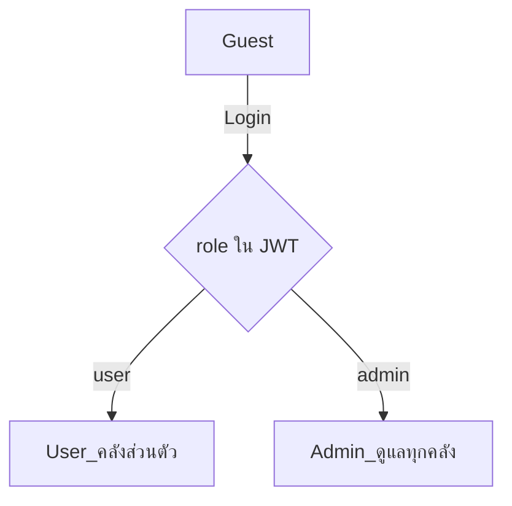
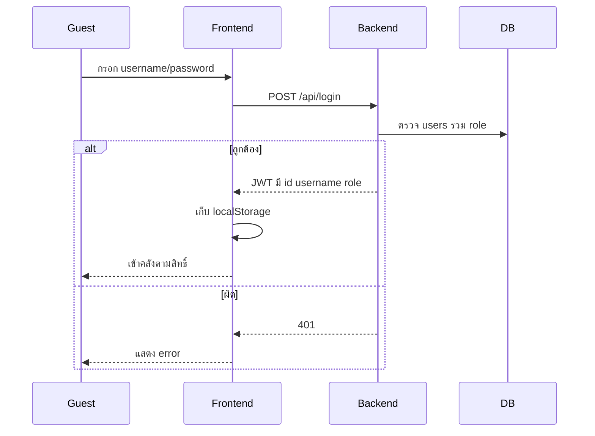

# Use Cases — Personal Book Library

เอกสาร Use Case (Phase 2.2)  
อ้างอิง schema: [data_dictionary.md](./data_dictionary.md)

## Actor

| Actor | `role` | คำอธิบาย |
|-------|--------|----------|
| Guest | — | ยังไม่ล็อกอิน (ไม่มี JWT) |
| User | `user` | ผู้ใช้ทั่วไป — จัดการได้เฉพาะคลังหนังสือส่วนตัวของตัวเอง |
| Admin | `admin` | ผู้ดูแล — ดู/ลบหนังสือได้ทุกคลัง |

---

## UC-01 เข้าสู่ระบบ (Login)

| รายการ | รายละเอียด |
|--------|------------|
| Actor | Guest → ได้เป็น User หรือ Admin ตาม `role` |
| Goal | ได้ JWT ที่มี `id`, `username`, `role` |
| Precondition | มีบัญชีในระบบ |
| Main flow | 1. เปิดเว็บ → ไปหน้า Login 2. กรอก username / password 3. `POST /api/login` 4. ผ่าน → JWT ฝัง `role` 5. เก็บ token ใน `localStorage` 6. เข้าหน้าคลัง |
| Alternate | credential ผิด → 401 + error |
| Postcondition | มี JWT; สิทธิ์ตาม `role` (`admin` หรือ `user`) |

### บัญชีทดสอบ

| username | password | role |
|----------|----------|------|
| `admin` | `password123` | `admin` |
| `spk1` | `password123` | `user` |
| `spk2` | `password123` | `user` |

---

## UC-02 User ดูคลังหนังสือส่วนตัว

| รายการ | รายละเอียด |
|--------|------------|
| Actor | User (`role = user`) |
| Goal | ดูเฉพาะหนังสือของตัวเอง |
| Precondition | JWT ถูกต้อง และ `role = user` |
| Main flow | 1. เปิดหน้าคลัง 2. `GET /api/books` + Bearer 3. Backend กรอง `user_owner = user.username` 4. แสดงรายการ + loading |
| Alternate | 401 → ลบ token → Login |
| Postcondition | ไม่เห็นหนังสือของ User/Admin คนอื่นในมุมมองคลังส่วนตัว |

---

## UC-03 Admin ดูหนังสือทุกคลัง

| รายการ | รายละเอียด |
|--------|------------|
| Actor | Admin (`role = admin`) |
| Goal | ดูรายการหนังสือทั้งหมดในระบบ |
| Precondition | JWT ถูกต้อง และ `role = admin` |
| Main flow | 1. เปิดหน้าคลัง 2. `GET /api/books` + Bearer 3. Backend ตรวจ `role = admin` → คืนทุกแถว 4. แสดงรายการ (อาจโชว์เจ้าของ/username ด้วยก็ได้) |
| Alternate | 401 → Login |
| Postcondition | Admin เห็นหนังสือของทุก user |

---

## UC-04 เพิ่มหนังสือ (User / Admin)

| รายการ | รายละเอียด |
|--------|------------|
| Actor | User หรือ Admin |
| Goal | เพิ่มหนังสือ — เจ้าของคือคนที่ล็อกอิน (หรือที่ admin กำหนด) |
| Precondition | ล็อกอินแล้ว |
| Main flow | 1. กรอกข้อมูลหนังสือ 2. `POST /api/books` + Bearer 3. ตั้ง `user_owner` = username เจ้าของคลัง, `uid_created` = username คนที่ล็อกอิน (audit) 4. อัปเดตรายการ + alert 5. เคลียร์ฟอร์ม + focus ช่องชื่อ |
| Alternate | ไม่มี token → 401 |
| Postcondition | หนังสือใหม่มี `user_owner` ชัดเจน |

---

## UC-05 User ลบหนังสือของตัวเอง

| รายการ | รายละเอียด |
|--------|------------|
| Actor | User |
| Goal | ลบหนังสือในคลังส่วนตัว |
| Precondition | ล็อกอินเป็น user และเป็นเจ้าของหนังสือ |
| Main flow | 1. กดลบ 2. `DELETE /api/books/:id` + Bearer 3. ลบเมื่อ `id` ตรงและ `user_owner` = username ของตัวเอง 4. อัปเดตรายการ + alert |
| Alternate | พยายามลบของคนอื่น → 404/403 ไม่มี token → 401 |
| Postcondition | ลบได้เฉพาะของตัวเอง |

---

## UC-06 Admin ลบหนังสือของใครก็ได้

| รายการ | รายละเอียด |
|--------|------------|
| Actor | Admin |
| Goal | ลบหนังสือในระบบได้ทุกเล่ม |
| Precondition | ล็อกอินเป็น admin |
| Main flow | 1. กดลบหนังสือ (ของตัวเองหรือของ user อื่น) 2. `DELETE /api/books/:id` + Bearer 3. Backend ตรวจ `role = admin` → ลบตาม `id` ได้เลย 4. อัปเดตรายการ + alert |
| Alternate | หนังสือไม่มี → 404 |
| Postcondition | หนังสือถูกลบแม้ไม่ใช่เจ้าของ |

---

## UC-07 Auth Guard (กัน Guest)

| รายการ | รายละเอียด |
|--------|------------|
| Actor | Guest |
| Goal | บังคับล็อกอินก่อนใช้ระบบ |
| Precondition | ไม่มี token |
| Main flow | 1. เปิดเว็บ 2. ไม่พบ token 3. ข้อความ `กรุณาเข้าสู่ระบบก่อนใช้งาน` 4. ไปหน้า Login |
| Postcondition | Guest อยู่ที่ Login |

---

## UC-08 Token หมดอายุ / 401

| รายการ | รายละเอียด |
|--------|------------|
| Actor | User หรือ Admin |
| Goal | ตัด session แล้วให้ login ใหม่ |
| Precondition | API ตอบ 401 |
| Main flow | 1. ได้ error session missing/expired 2. ลบ token 3. ไป Login |
| Postcondition | ต้อง login ใหม่ |

---

## UC-09 แยกสิทธิ์ Admin กับ User

| รายการ | รายละเอียด |
|--------|------------|
| Actor | Admin + User (`spk1`) |
| Goal | พิสูจน์ว่า role ทำงานถูกต้อง |
| Main flow | 1. `spk1` (user) เพิ่มหนังสือ → เห็นเฉพาะของตัวเอง 2. `admin` ล็อกอิน → เห็นหนังสือของ spk1 ด้วย 3. `spk1` พยายามลบหนังสือของคนอื่น → ไม่ได้ 4. `admin` ลบหนังสือของ spk1 ได้ |
| Postcondition | User ถูกจำกัดคลังส่วนตัว; Admin ดูแลทั้งระบบ |

---

## สรุป Use Case ↔ API / สิทธิ์

| UC | Actor | API / พฤติกรรม |
|----|-------|----------------|
| UC-01 | Guest | `POST /api/login` → JWT มี `role` |
| UC-02 | User | `GET /api/books` กรอง `user_owner` (username) |
| UC-03 | Admin | `GET /api/books` ทั้งระบบ |
| UC-04 | User/Admin | `POST /api/books` |
| UC-05 | User | `DELETE` เฉพาะของตัวเอง |
| UC-06 | Admin | `DELETE` ได้ทุกเล่ม |
| UC-07 | Guest | Auth Guard |
| UC-08 | User/Admin | จัดการ 401 |
| UC-09 | Admin+User | ทดสอบแยกสิทธิ์ |
